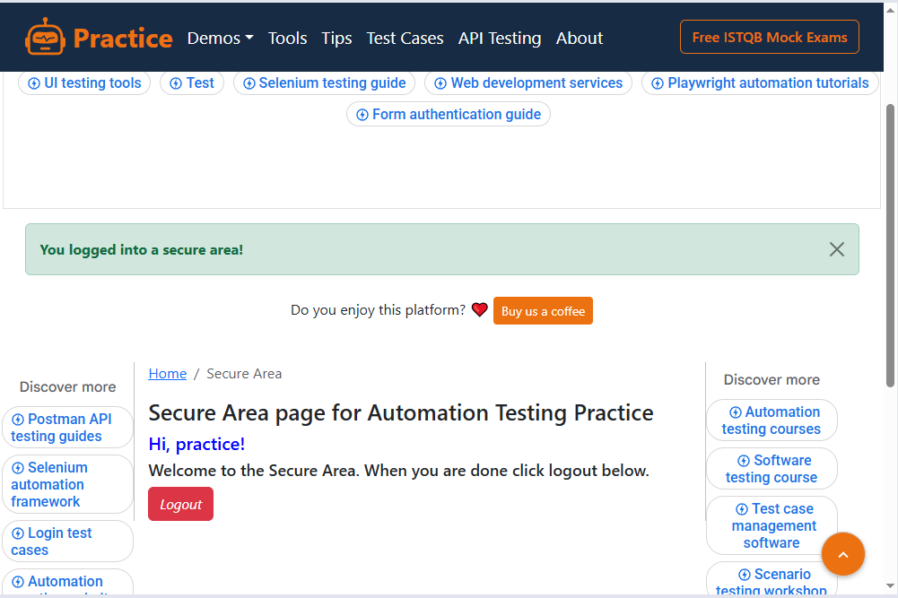
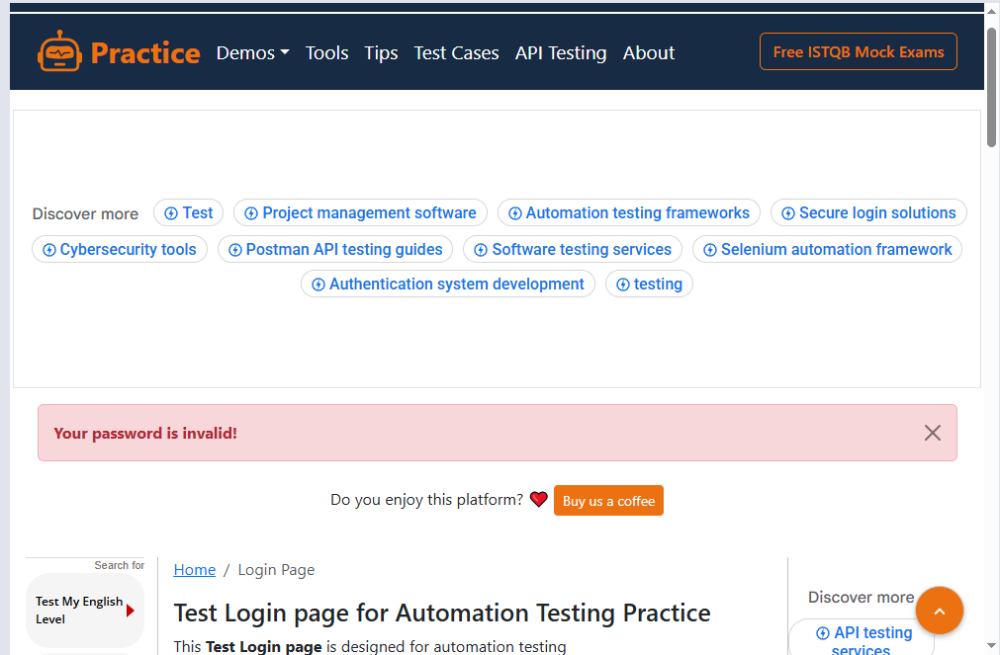
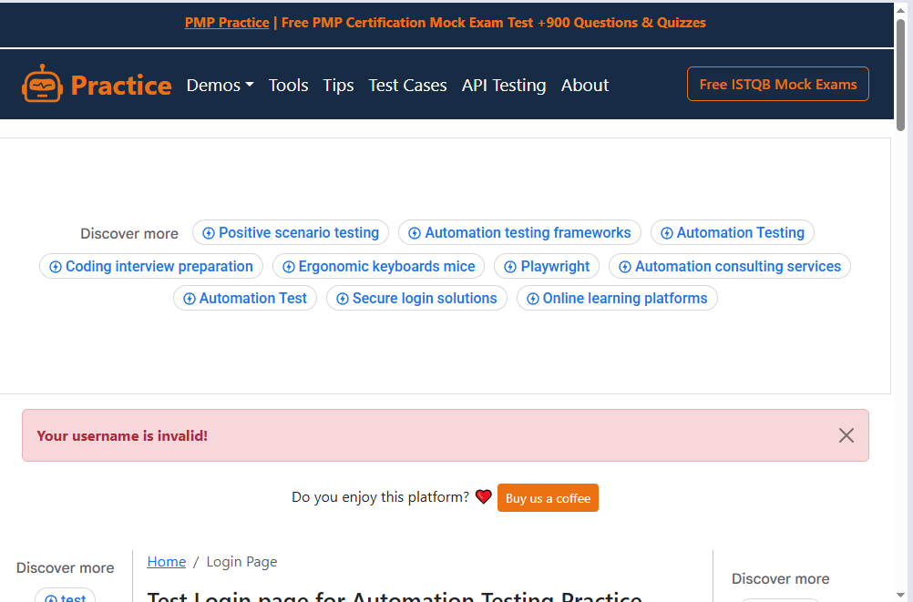
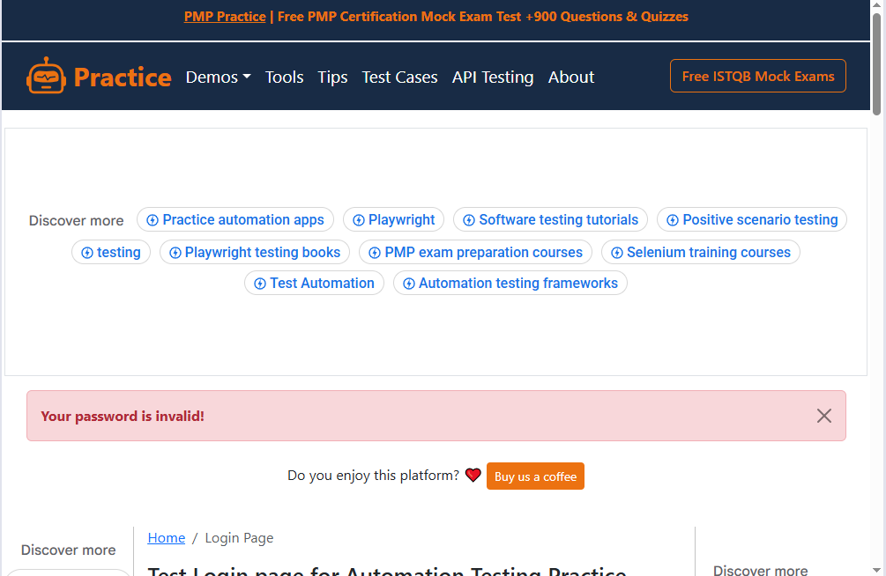
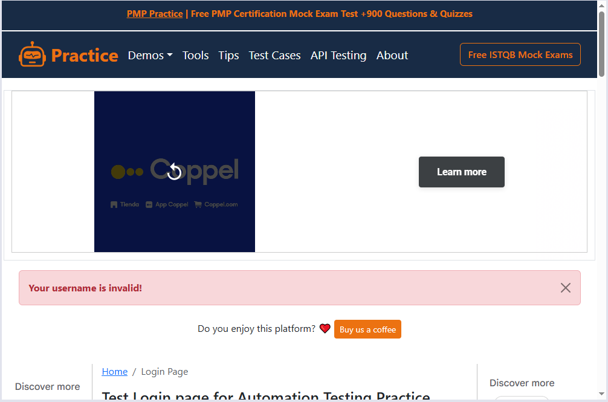
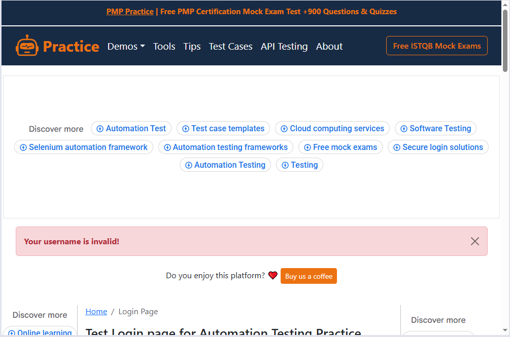
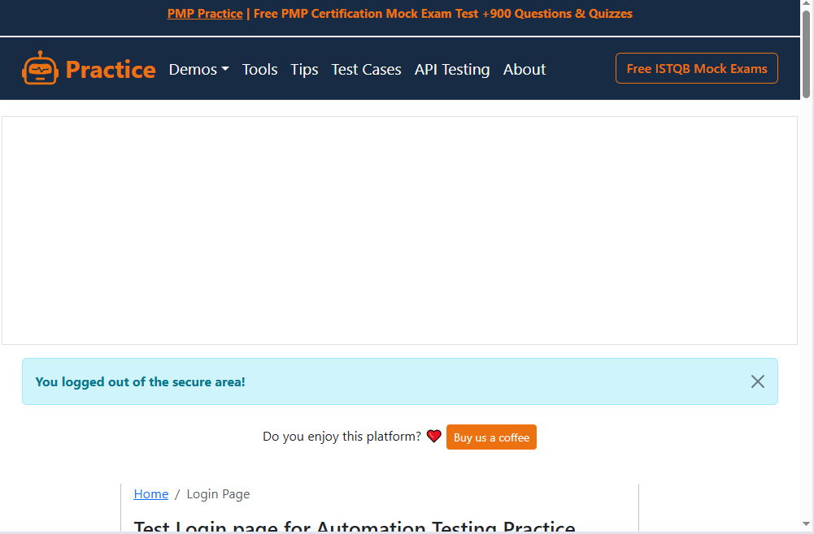
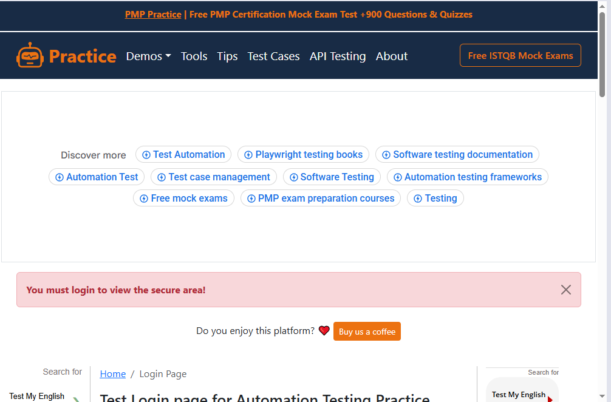
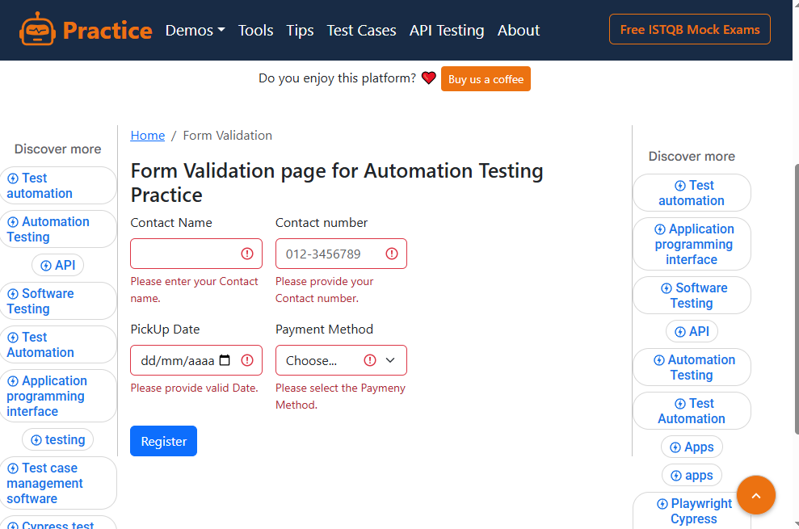
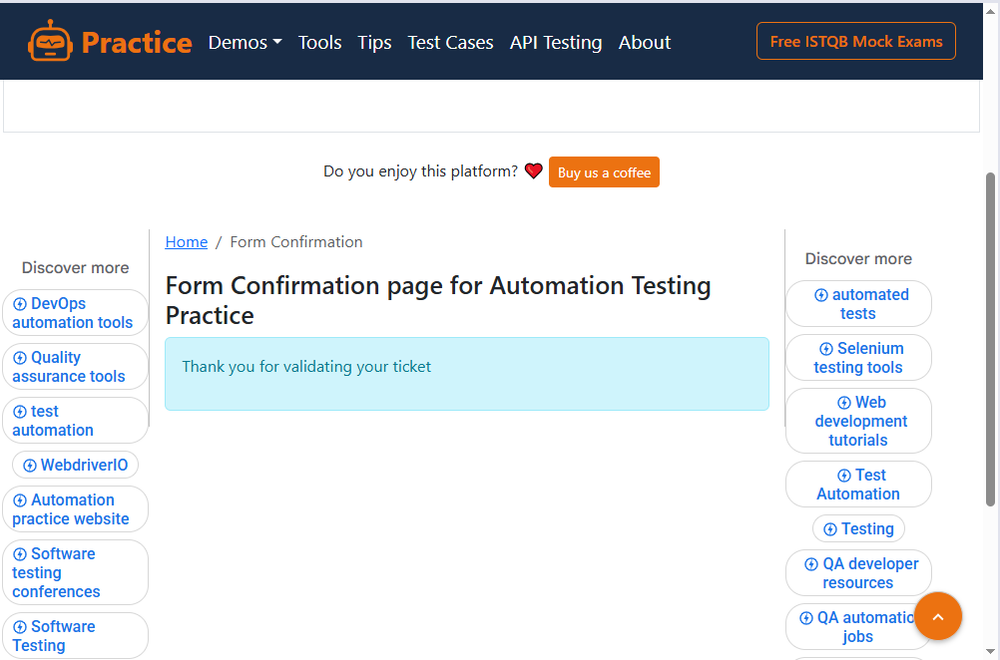

## CASOS DE TESTE MANUAIS
### (ID 001) – LOGIN COM AS CREDENCIAIS VÁLIDAS

### PASSOS:
- Acessar a página de login https://practice.expandtesting.com/login
- Informar usuário válido
- Informar senha válida
- Clicar em "Login"

### DADOS DE TESTE:
- Username: practice
- Password: SuperSecretPassword!

### RESULTADO ESPERADO:
- Usuário é autenticado com sucesso
- Sistema redireciona para a página inicial

### RESULTADO OBTIDO:
Login realizado com sucesso: You logged into a secure area!

### EVIDENCIA:

## (ID 002) - LOGIN COM SENHA INVÁLIDA

### PASSOS:
- Acessar a página de login https://practice.expandtesting.com/login
- Informar usuário válido
- Informar senha inválida
- Clicar em "Login"

### DADOS DE TESTE
- Username: practice
- Password: Senha errada

### RESULTADO ESPERADO:
- Mensagem de erro exibida: Your password is invalid!

### EVIDENCIA:

## (ID 003) - LOGIN COM USUARIO VAZIO

### PASSOS:
- Acessar a página de login https://practice.expandtesting.com/login
- Informar usuário: vazio
- Password: SuperSecretPassword!

### RESULTADO ESPERADO:
- Mensagem de erro exibida: Your username is invalid!

### EVIDENCIA:

## (ID 004) - LOGIN COM A SENHA VAZIA

### PASSOS:
- Acessar a página de login https://practice.expandtesting.com/login
- Informar usuário: practice
- Password: vazio

### RESULTADO ESPERADO:
- Mensagem de erro exibida: Your password is invalid!

### EVIDENCIA:

## (ID 005) - LOGIN COM USUÁRIO E SENHA VAZIA

### PASSOS:
- Acessar a página de login https://practice.expandtesting.com/login
- informar usuário: vazio
- password: vazio

### RESULTADO ESPERADO:
- Mensagem de erro exibida: Your username is invalid!

### EVIDENCIA:

## (ID 006) - LOGIN COM CARACTERES ESPECIAIS

### PASSOS:
- Acessar a página de login https://practice.expandtesting.com/login
- informar usuário: !@#$% 
- password: ^&*()

### RESULTADO ESPERADO:
- Mensagem de erro exibida: Your username is invalid!

### EVIDENCIA:

## (ID 007) - LOGOUT DO SISTEMA

### PASSOS:
- Acessar a página de login https://practice.expandtesting.com/login
- informar usuário: practice 
- password: SuperSecretPassword!

### RESULTADO ESPERADO:
- Mensagem de erro exibida: You logged out of the secure area!

### EVIDENCIA:

## (ID 008) - ACESSO SEM LOGIN

### PASSOS:
- Acessar a página de login https://practice.expandtesting.com/secure

### RESULTADO ESPERADO:
- Mensagem de erro exibida: You must login to view the secure area!

### EVIDENCIA:

                            
## (ID 009) - Envio com campos vazios

### PASSOS 
- Acessar a pagina de Formulario https://practice.expandtesting.com/form-validation
- Informar o Contact Name : Vazio
- Informar o Contact number: Vazio
- Informar o PickUp Date: Vazio
- Informar o Payment Method: Vazio
- Click em Register

### RESULTADO ESPERADO:
- Mensagem de erro exibida: Please enter your Contact name. , Please provide your Contact number. , Please provide valid Date. , Please select the Paymeny Method. 

### EVIDENCIA:

## (ID 010) - Envio com dados válidos

### PASSOS
- Acessar a pagina de Formulario https://practice.expandtesting.com/form-validation
- Informar o Contact Name :Blay
- Informar o Contact number: 013-3456789
- Informar o PickUp Date: 1212-02-12
- Informar o Payment Method: card
- Click em Register

### RESULTADO ESPERADO: Thank you for validating your ticket

### EVIDENCIA:

