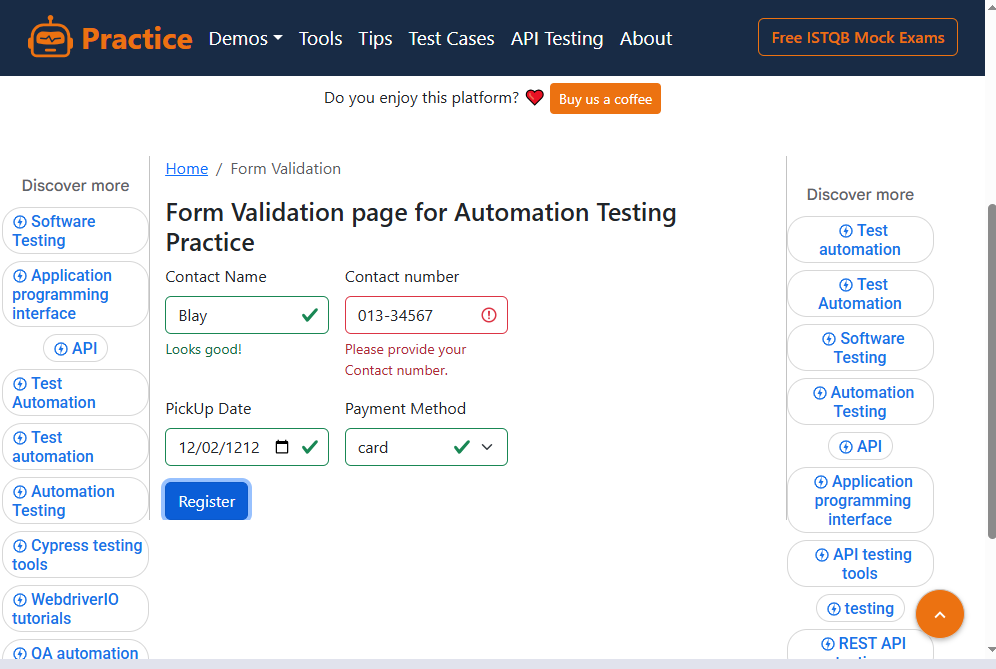
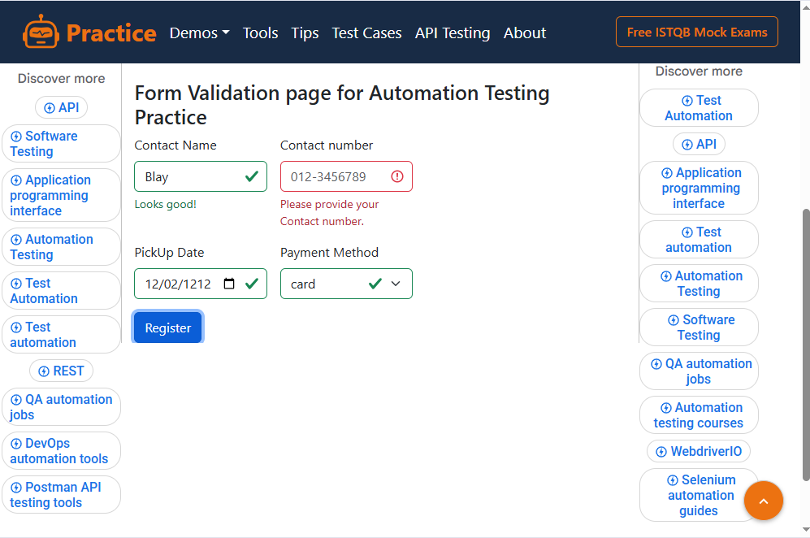
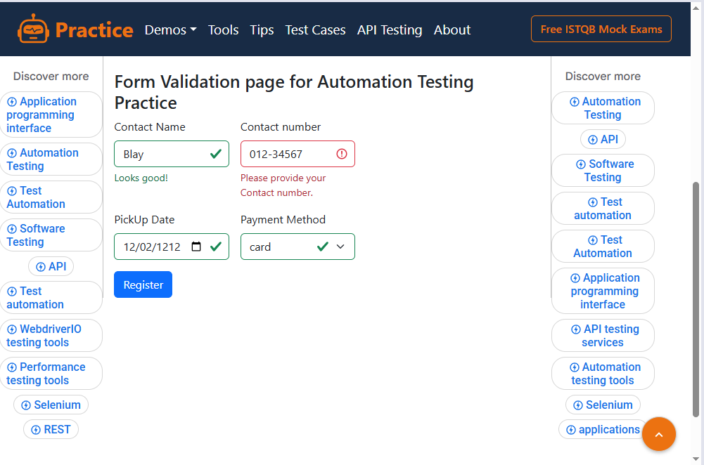
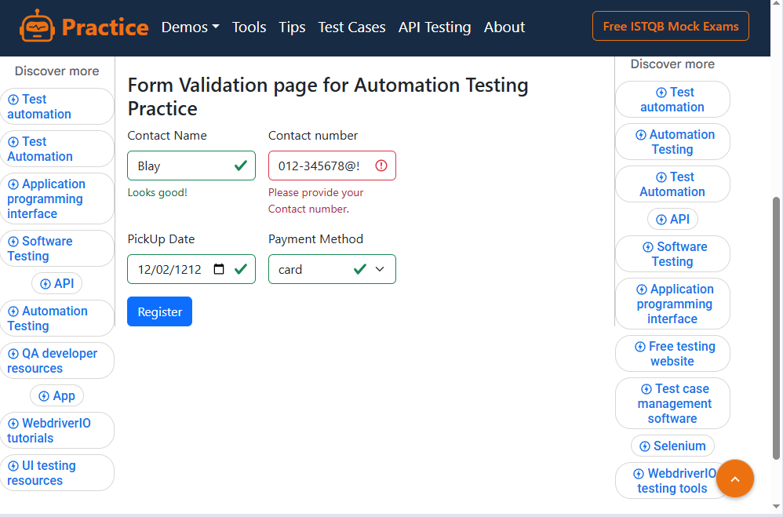
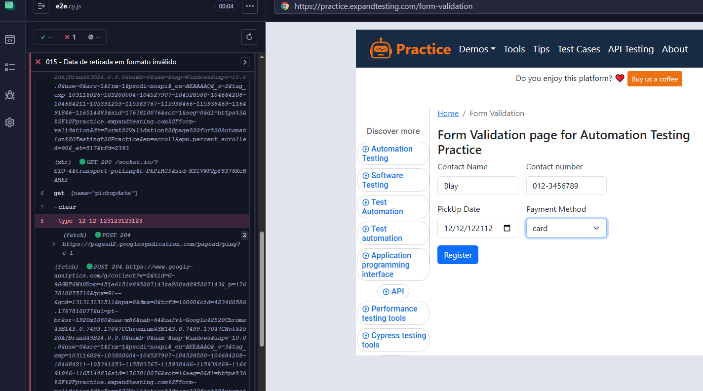
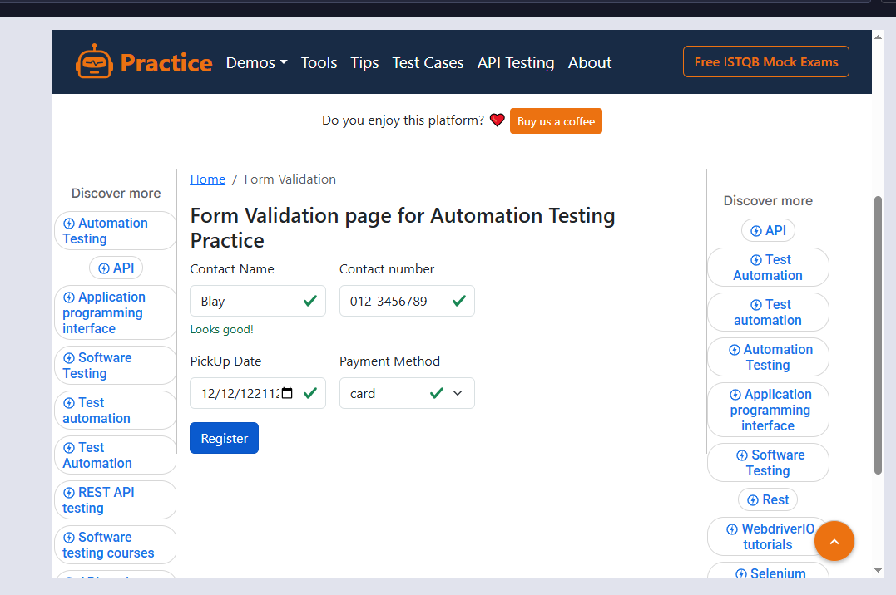
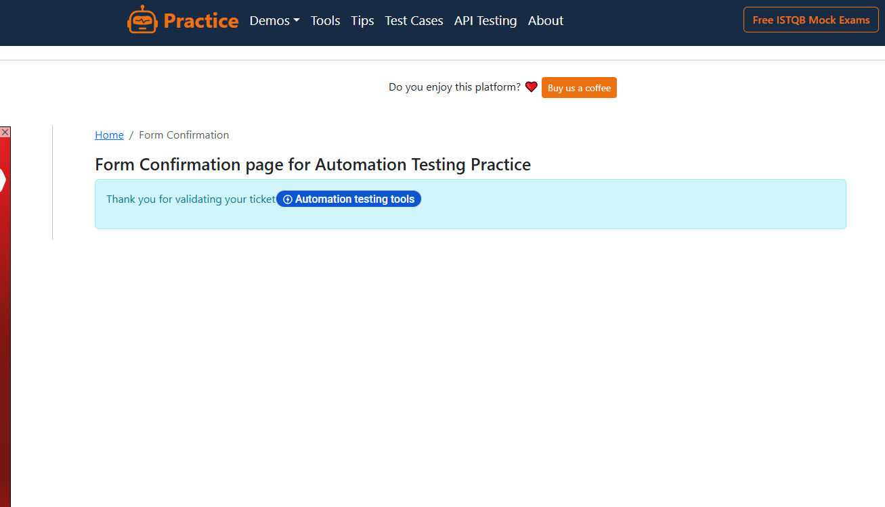
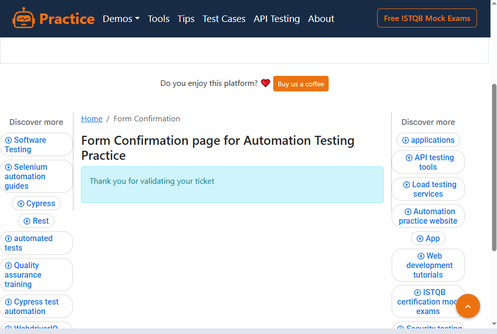
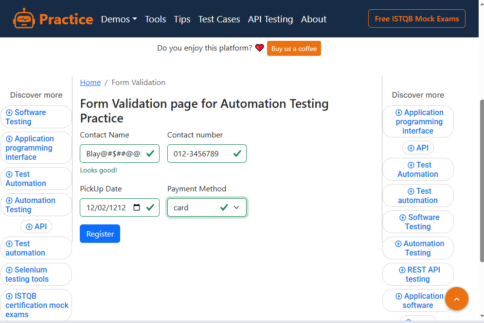
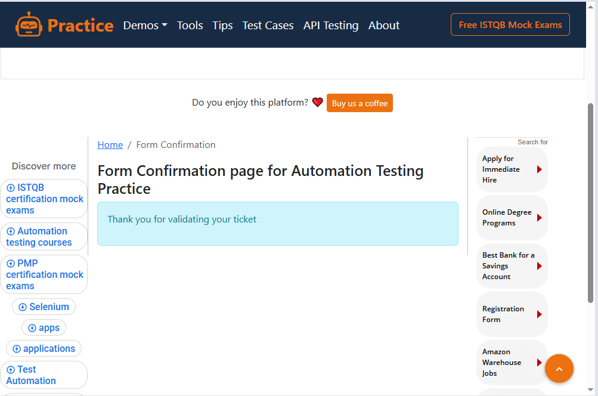

## CASOS DE TESTE MANUAIS
### (ID 001) – LOGIN COM AS CREDENCIAIS VÁLIDAS

### PASSOS:
- Acessar a página de login https://practice.expandtesting.com/login
- Informar usuário válido
- Informar senha válida
- Clicar em "Login"

### DADOS DE TESTE:
- Username: practice
- Password: SuperSecretPassword!

### RESULTADO ESPERADO:
- Usuário é autenticado com sucesso
- Sistema redireciona para a página inicial

### RESULTADO OBTIDO:
Login realizado com sucesso: You logged into a secure area!

# PASSOU 🟢

### EVIDENCIA:

## (ID 002) - LOGIN COM SENHA INVÁLIDA

### PASSOS:
- Acessar a página de login https://practice.expandtesting.com/login
- Informar usuário válido
- Informar senha inválida
- Clicar em "Login"

### DADOS DE TESTE
- Username: practice
- Password: Senha errada

### RESULTADO ESPERADO: deve aparecer a seguinte mensagem!
- Your password is invalid!

### RESULTADO OBTIDO:
- Your password is invalid!

# PASSOU 🟢

### EVIDENCIA:

## (ID 003) - LOGIN COM USUARIO VAZIO

### PASSOS:
- Acessar a página de login https://practice.expandtesting.com/login
- Informar usuário: vazio
- Password: SuperSecretPassword!

### RESULTADO ESPERADO: deve aparecer a seguinte mensagem!
- Mensagem de erro exibida: Your username is invalid!

### RESULTADO OBTIDO:
- Your username is invalid!

# PASSOU 🟢

### EVIDENCIA:

## (ID 004) - LOGIN COM A SENHA VAZIA

### PASSOS:
- Acessar a página de login https://practice.expandtesting.com/login
- Informar usuário: practice
- Password: vazio

### RESULTADO ESPERADO: deve aparecer a seguinte mensagem!
- Mensagem de erro exibida: Your password is invalid!

### RESULTADO OBTIDO:
- Your password is invalid!

# PASSOU 🟢

### EVIDENCIA:

## (ID 005) - LOGIN COM USUÁRIO E SENHA VAZIA

### PASSOS:
- Acessar a página de login https://practice.expandtesting.com/login
- informar usuário: vazio
- password: vazio

### RESULTADO ESPERADO: deve aparecer a seguinte mensagem!
- Mensagem de erro exibida: Your username is invalid!

### RESULTADO OBTIDO:
- Your username is invalid!

# PASSOU 🟢

### EVIDENCIA:

## (ID 006) - LOGIN COM CARACTERES ESPECIAIS

### PASSOS:
- Acessar a página de login https://practice.expandtesting.com/login
- informar usuário: !@#$% 
- password: ^&*()

### RESULTADO ESPERADO: deve aparecer a seguinte mensagem!
- Mensagem de erro exibida: Your username is invalid!,Your username is invalid!

### RESULTADO OBTIDO:
- Your password is invalid!
- Your username is invalid!

# PASSOU 🟢

### EVIDENCIA:

## (ID 007) - LOGOUT DO SISTEMA

### PASSOS:
- Acessar a página de login https://practice.expandtesting.com/login
- informar usuário: practice 
- password: SuperSecretPassword!

### RESULTADO ESPERADO: deve aparecer a seguinte mensagem!
- Mensagem de erro exibida: You logged out of the secure area!

### RESULTADO OBTIDO:
- You logged out of the secure area!

# PASSOU 🟢

### EVIDENCIA:

## (ID 008) - ACESSO SEM LOGIN

### PASSOS:
- Acessar a página de login https://practice.expandtesting.com/secure

### RESULTADO ESPERADO: deve aparecer a seguinte mensagem!
- Mensagem de erro exibida: You must login to view the secure area!

### RESULTADO OBTIDO:
- You must login to view the secure area!

# PASSOU 🟢

### EVIDENCIA:

                            
## (ID 009) - Envio com campos vazios

### PASSOS 
- Acessar a pagina de Formulario https://practice.expandtesting.com/form-validation
- Informar o Contact Name : Vazio
- Informar o Contact number: Vazio
- Informar o PickUp Date: Vazio
- Informar o Payment Method: Vazio
- Click em Register

### RESULTADO ESPERADO: deve aparecer as seguintes mensagem!
- Mensagem de erro exibida: 
- Please enter your Contact name. 
- Please provide your Contact number. 
- Please provide valid Date. 
- Please select the Paymeny Method. 

### RESULTADO OBTIDO:
- Mensagem de erro exibida: 
- Please enter your Contact name. 
- Please provide your Contact number. 
- Please provide valid Date. 
- Please select the Paymeny Method.

# PASSOU 🟢

### EVIDENCIA:

## (ID 010) - Envio com dados válidos

### PASSOS
- Acessar a pagina de Formulario https://practice.expandtesting.com/form-validation
- Informar o Contact Name :Blay
- Informar o Contact number: 013-3456789
- Informar o PickUp Date: 1212-02-12
- Informar o Payment Method: card
- Click em Register

### RESULTADO ESPERADO: deve aparecer a seguinte mensagem!
- Thank you for validating your ticket

### RESULTADO OBTIDO:
- Thank you for validating your ticket

# PASSOU 🟢

### EVIDENCIA:

## (ID 011) - Validação de campo obrigatório/número inválido

### PASSOS
- Acessar a pagina de Formulario https://practice.expandtesting.com/form-validation
- Informar o Contact Name :Blay
- Informar o Contact number: 013-34567
- Informar o PickUp Date: 1212-02-12
- Informar o Payment Method: card
- Click em Register

### RESULTADO ESPERADO: deve aparecer a seguinte mensagem!
- Please provide your Contact number.

### RESULTADO OBTIDO:
- Please provide your Contact number.

# PASSOU 🟢

### EVIDENCIA 

## (ID 012) - Número de contato vazio

### PASSOS 
- Acessar a pagina de Formulario https://practice.expandtesting.com/form-validation
- Informar o Contact Name :Blay
- Informar o Contact number:
- Informar o PickUp Date: 1212-02-12
- Informar o Payment Method: card
- Click em Register

### RESULTADO ESPERADO: deve aparecer a seguinte mensagem!
- Please provide your Contact number.

### RESULTADO OBTIDO:
- Please provide your Contact number.

# PASSOU 🟢

### EVIDENCIA

## (ID 013) - Número de contato com menos dígitos

### PASSOS 
- Acessar a pagina de Formulario https://practice.expandtesting.com/form-validation
- Informar o Contact Name :Blay
- Informar o Contact number: 013-34567
- Informar o PickUp Date: 1212-02-12
- Informar o Payment Method: card
- Click em Register

### RESULTADO ESPERADO: deve aparecer a seguinte mensagem!
- Please provide your Contact number.

### RESULTADO OBTIDO:
- Please provide your Contact number.

# PASSOU 🟢

### EVIDENCIA

## (ID 014) - Número de contato com letras ou caracteres especiais

### PASSOS
- Acessar a pagina de Formulario https://practice.expandtesting.com/form-validation
- Informar o Contact Name :Blay
- Informar o Contact number: 012-345678@!
- Informar o PickUp Date: 1212-02-12
- Informar o Payment Method: card
- Click em Register

### RESULTADO ESPERADO: deve aparecer a seguinte mensagem! 
- Please provide your Contact number

### RESULTADO OBTIDO:
- Please provide your Contact number

# PASSOU 🟢

### EVIDENCIA

## (ID 015) - Data de retirada em formato inválido

### PASSOS
- Acessar a pagina de Formulario https://practice.expandtesting.com/form-validation
- Informar o Contact Name :Blay
- Informar o Contact number: 012-3456789
- Informar o PickUp Date: 123123-02-12
- Informar o Payment Method: card
- Click em Register

### RESULTADO ESPERADO: 
- O sistema não deve permitir o envio do formulário quando o campo PickUp Date estiver em um formato de data inválido.

### RESULTADO OBTIDO
- O sistema permite o envio do formulário mesmo quando o campo PickUp Date é preenchido com valores inválidos exmplo 12-02-123123 

# NÃO PASSOU 🚫

### EVIDENCIA 01
- Bug no cypress.

### EVIDENCIA 02
- Fui olhar se passava no manual ... PASSOU NO MANUAL

### EVIDENCIA 03
- passou como se nada tivesse acontecido!

## (ID 016) - Método de pagamento não selecionado

### PASSOS
- Acessar a pagina de Formulario https://practice.expandtesting.com/form-validation
- Informar o Contact Name :Blay
- Informar o Contact number: 012-3456789
- Informar o PickUp Date: 1212-02-12
- Informar o Payment Method: não selecionar nada
- Click em Register

### RESULTADO ESPERADO: deve aparecer a seguinte mensagem!
- Please select the Paymeny Method.

### RESULTADO OBTIDO:
- Please select the Paymeny Method.

# PASSOU 🟢

### EVIDENCIA:

## (ID 017) - Preenchimento correto de todos os campos

### PASSOS
- Acessar a pagina de Formulario https://practice.expandtesting.com/form-validation
- Informar o Contact Name : Blay
- Informar o Contact number: 012-3456789
- Informar o PickUp Date: 1212-02-12
- Informar o Payment Method: card
- Click em Register

### RESULTADO ESPERADO: Deve aparecer a seguinte mensagem!
- Thank you for validating your ticket
- URL DE CONFIRMAÇÃO https://practice.expandtesting.com/form-confirmation

### RESULTADO OBTIDO: 
- Thank you for validating your ticket
- https://practice.expandtesting.com/form-confirmation

# PASSOU 🟢

### EVIDENCIA:

## (ID 018) - Teste de limite de caracteres no nome 

### PASSOS
- Acessar a pagina de Formulario https://practice.expandtesting.com/form-validation
- Informar o Contact Name : Blay@#$##@@!:
- Informar o Contact number: 012-3456789
- Informar o PickUp Date: 1212-02-12
- Informar o Payment Method: card
- Click em Register

### RESULTADO ESPERADO: O sistema deve exibir mensagem de erro informando que o campo"Contact Name" aceita apenas letras e números, não permitindo caracteres especiais.

### RESULTADO OBTIDO: 
- O sistema permitiu o envio do formulário com o campo "Contact Name"
preenchido com diversos caracteres especiais, sem exibir qualquer
mensagem de erro ou validação ao usuário.

# NÃO PASSOU 🚫

### EVIDENCIA:

